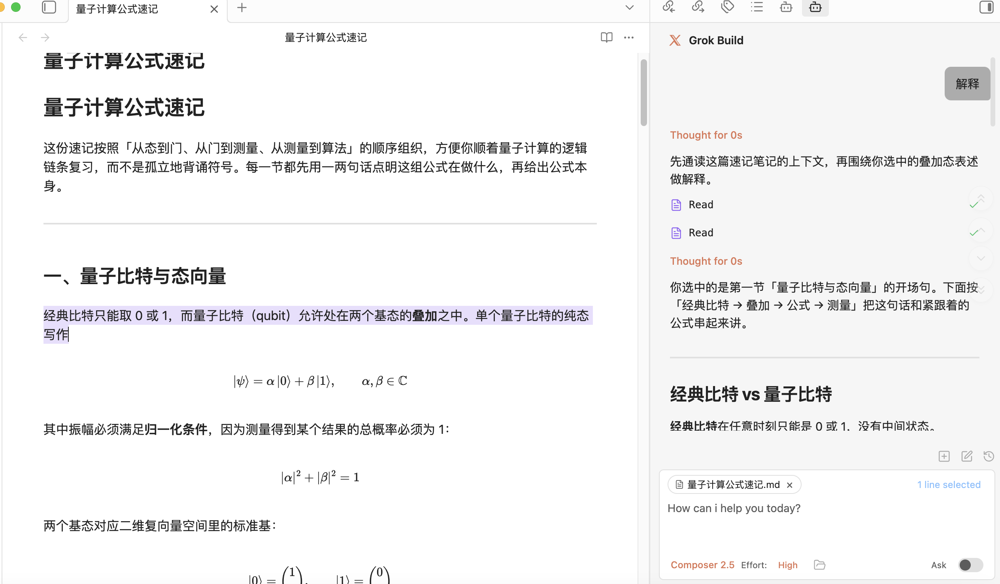

# Grok Build for Obsidian




An Obsidian plugin that embeds xAI Grok Build in your vault. This project is based on Claudian and modified to adapt Claudian's agent workflow for Grok Build.

## Features & Usage

Open the Grok Build chat sidebar from the ribbon icon or command palette. Select text and use the hotkey for inline edit. Grok Build runs with your vault as its working directory, so it can read, write, edit, and search files in your vault.

**Inline Edit** — Select text or start at the cursor position + hotkey to edit directly in notes with word-level diff preview.

**Slash Commands & Skills** — Type `/` or `$` for reusable prompt templates or Skills from user- and vault-level scopes.

**`@mention`** - Type `@` to mention anything you want the agent to work with, vault files, subagents, MCP servers, or files in external directories.

**Plan Mode** — Toggle via `Shift+Tab`. The agent explores and designs before implementing, then presents a plan for approval.

**Instruction Mode (`#`)** — Refined custom instructions added from the chat input.

**MCP Servers** — Grok Build manages MCP through its own CLI-native configuration.

**Multi-Tab & Conversations** — Multiple chat tabs, conversation history, fork, resume, and compact.

## Requirements

- [Grok CLI](https://x.ai/cli) installed and authenticated with `grok login`.
- Obsidian v1.7.2+
- Desktop only (macOS, Linux, Windows)

## Installation

### From GitHub Release

1. Download `main.js`, `manifest.json`, and `styles.css` from the [latest release](https://github.com/YuChenSSR/grok-build-obsidian/releases/latest)
2. Create a folder called `grok-build` in your vault's plugins folder:
   ```
   /path/to/vault/.obsidian/plugins/grok-build/
   ```
3. Copy the downloaded files into the `grok-build` folder
4. Enable the plugin in Obsidian:
   - Settings → Community plugins → Enable "Grok Build"

### From source (development)

1. Clone this repository into your vault's plugins folder:
   ```bash
   cd /path/to/vault/.obsidian/plugins
   git clone https://github.com/YuChenSSR/grok-build-obsidian.git grok-build
   cd grok-build
   ```

2. Install dependencies and build:
   ```bash
   npm install
   npm run build
   ```

3. Enable the plugin in Obsidian:
   - Settings → Community plugins → Enable "Grok Build"

### Development

```bash
# Watch mode
npm run dev

# Production build
npm run build
```

## Privacy & Data Use

- **Sent to API**: Your input, attached files, images, and tool call outputs are sent through Grok Build according to the Grok CLI's behavior and your xAI account/API configuration.
- **Local storage**: Grok Build settings and session metadata are stored in `vault/.grok-build/`.
- **Environment variables**: Provider subprocesses inherit the Obsidian process environment plus any variables you configure in the plugin. This is needed for CLI authentication, proxies, certificates, and PATH resolution.
- **Device-specific paths**: Per-device CLI paths use an opaque local key stored in browser local storage, not your system hostname.
- **Background activity**: This plugin does not run telemetry beacons. UI polling timers read local Obsidian/editor selection state only. Network activity is limited to explicit Grok Build runtime work, configured MCP endpoints, and CLI calls needed to answer your requests.

## Troubleshooting

### Grok CLI not found

If you encounter `spawn grok ENOENT` or `Grok CLI not found`, the plugin can't auto-detect your Grok installation.

**Solution**: Leave the setting empty first so the plugin can auto-detect Grok. If auto-detection fails, find your CLI path and set it in Settings → Grok Build → CLI path.

| Platform | Command | Example Path |
|----------|---------|--------------|
| macOS/Linux | `which grok` | `/Users/you/.grok/bin/grok` |
| Windows (native) | `where.exe grok` | `C:\Users\you\.grok\bin\grok.exe` |

**Alternative**: Add your Node.js bin directory to PATH in Settings → Environment → Custom variables.

### npm CLI and Node.js not in same directory

If using a shell-managed CLI, check whether `grok` is visible to GUI apps:
```bash
which grok
```

If different, GUI apps like Obsidian may not find Node.js.

**Solutions**:
1. Install native binary (recommended)
2. Add Node.js path to Settings → Environment: `PATH=/path/to/node/bin`

If you have a feature request or run into any bugs, please [submit a GitHub issue](https://github.com/YuChenSSR/grok-build-obsidian/issues).

## Architecture

```
src/
├── main.ts                      # Plugin entry point
├── app/                         # Shared defaults and plugin-level storage
├── core/                        # Provider-neutral runtime, registry, and type contracts
│   ├── runtime/                 # ChatRuntime interface and approval types
│   ├── providers/               # Provider registry and workspace services
│   ├── auxiliary/               # Shared provider auxiliary services
│   ├── bootstrap/               # Plugin bootstrap wiring
│   ├── security/                # Approval utilities
│   └── ...                      # commands, mcp, prompt, storage, tools, types
├── providers/
│   ├── claude/                  # Claude SDK adaptor, prompt encoding, storage, MCP, plugins
│   ├── codex/                   # Codex app-server adaptor, JSON-RPC transport, JSONL history
│   ├── opencode/                # Opencode adaptor
│   ├── pi/                      # Pi RPC adaptor, model discovery, JSONL history
│   └── acp/                     # Agent Client Protocol shared transport
├── features/
│   ├── chat/                    # Sidebar chat: tabs, controllers, renderers
│   ├── inline-edit/             # Inline edit modal and provider-backed edit services
│   └── settings/                # Settings shell with provider tabs
├── shared/                      # Reusable UI components and modals
├── i18n/                        # Internationalization (10 locales)
├── types/                       # Shared ambient types
├── utils/                       # Cross-cutting utilities
└── style/                       # Modular CSS
```

## Roadmap

- [x] Grok Build provider integration
- [x] Local install path separated from Claudian
- [ ] More Grok Build runtime testing across platforms

## License

Licensed under the [MIT License](LICENSE).

## Star History

<a href="https://www.star-history.com/?repos=YuChenSSR%2Fgrok-build-obsidian&type=date&legend=top-left">
 <picture>
   <source media="(prefers-color-scheme: dark)" srcset="https://api.star-history.com/image?repos=YuChenSSR/grok-build-obsidian&type=date&theme=dark&legend=top-left" />
   <source media="(prefers-color-scheme: light)" srcset="https://api.star-history.com/image?repos=YuChenSSR/grok-build-obsidian&type=date&legend=top-left" />
   
 </picture>
</a>

## Acknowledgments

- [Claudian](https://github.com/YishenTu/claudian), which this plugin is based on.
- [Obsidian](https://obsidian.md) for the plugin API
- [xAI](https://x.ai/) for Grok Build and the [Grok CLI](https://x.ai/cli)
